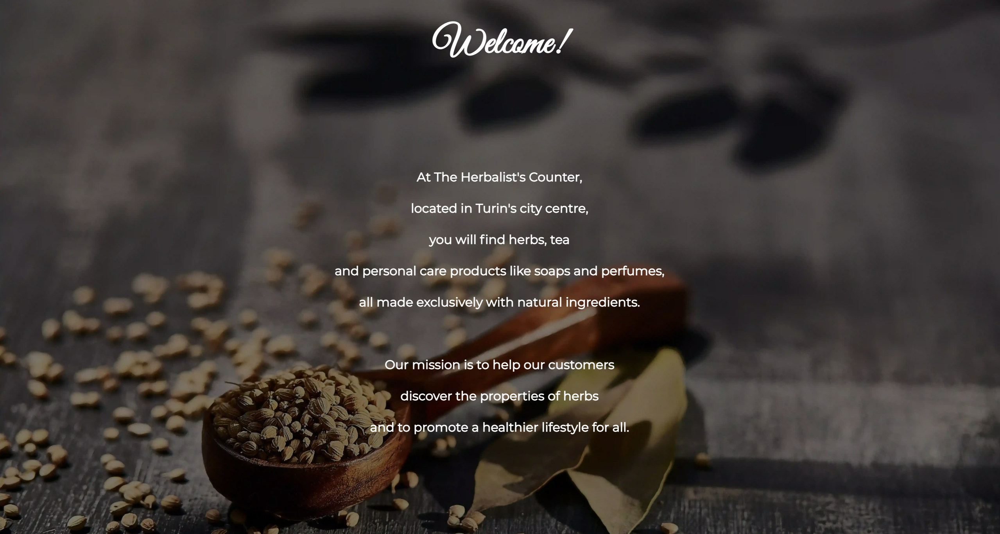
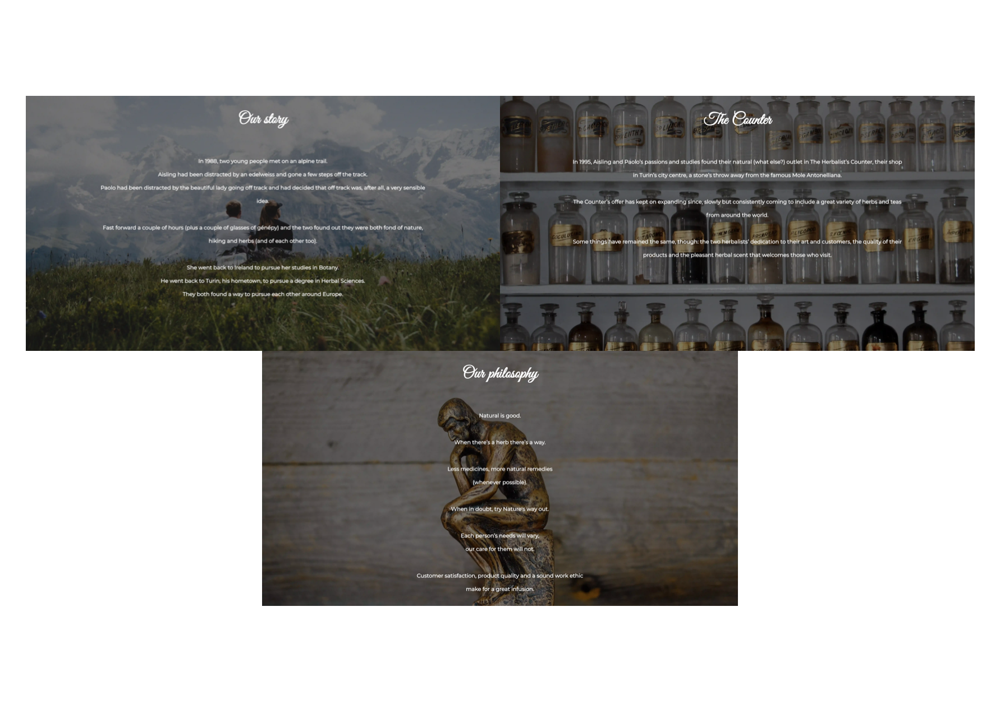
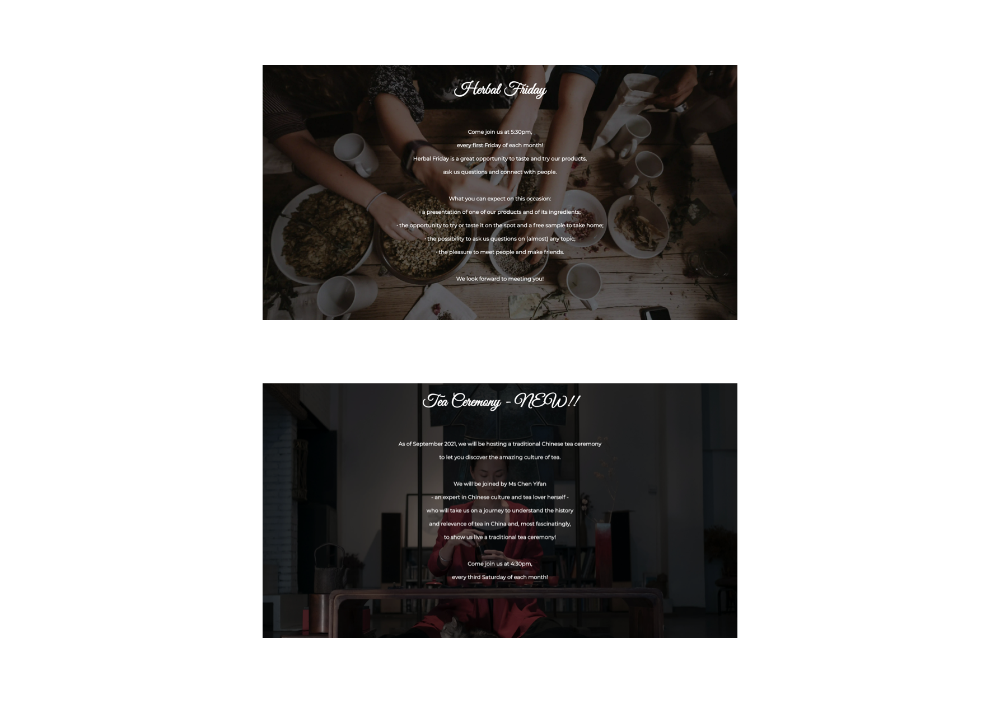

# **The Herbalist's Counter**

The Herbalist's Counter is the website for a herbalist's shop located in Turin, Italy. It is aimed both at first-time customers who are looking for a herbalist in the area and at returning customers who know the shop.

The goal of the Counter and its website is not only to advertise its products for commercial purposes, but also to educate people about the properties of herbs and herbal medicine, thus promoting a healthier lifestyle for all.

View the live project here: https://gabriele-andolina.github.io/herbalist-counter/.

## **1. Site Owner's Goals**
The two herbalists who own the website have two objectives in mind: to make their shop and products known, as well as to educate people about herbs and, more generally, the abundance of natural remedies they have studied and benefited from for years. They have a commercial purpose in mind, in that they make a living out of their herbalist's shop, but they also want to improve their customers' health condition through herbal medicine. Their website is the way to do that: on the one hand, they clearly state what kind of products can be found and purchased in their shop; on the other hand, they tell users a story - their story, how they met, how their passion for and knowledge about herbs have come to be - and they promote two monthly events customers can attend to learn about herbs, try the shop's products and hopefully socialise in the process.
## **2. User Goals (UX)**
* First-time user/visitor:
The first type of website users are the people in search of a herbalist in the city of Turin. They don't know the Counter yet, so they open their browser and search for such a shop in the city. Among the results, they find out about The Herbalist's Counter and start navigating on the website. 
* Returning user/visitor:
The second type of users are already acquainted with the shop, having already been there in the past and having enjoyed the experience. They have taken part in the Herbal Friday event once or twice, have had fun there and learnt something new about herbs. They are now in need of another visit to the shop, for instance to purchase a herbal tea for their cold, and they open the website to remind themselves of the opening hours and see if anything new is on offer at the Counter.

## **3. Features**
### 3.1 *Existing features*
* Shop logo & Navigation Bar

At the top of each page the user can find the shop logo and the navigation bar. The clickable shop logo represents a shortcut to go back to the homepage, whereas the navigation bar allows for navigation to all the pages in the website: Home, Our shop, Our products, Events, Contact us.

* Homepage

The website's homepage concisely informs users of the shop's location, products and mission.

* Our shop

 Divided in three sections, it provides an opportunity to learn about the story of the two herbalists, their shop and their philosophy/approach to their work.

 * Our products

The products' page allows the site owners to promote their products and the site users to know what they will find in the shop.

* Events

This page serves the shop/website's educational vocation: in it, the two owners promote two events that will attract people to their shop to try their products and learn about herbs. Users come to understand that The Herbalist's Counter is more than just a herbalist's shop: it is a place to meet people, learn something new and find out about ways to improve their health condition.

* Contact us

Here important information about the shop's location and opening hours are shown. The page also provides the users with an opportunity to engage with the two herbalists by filling out a contact form with a personal inquiry.

* Thank-you note

The *Thank you* page, reachable only after filling out the contact form, lets the users know that their message has been successfully sent, that it is appreciated and that a reply will follow soon.

* Copyright & Social media

Placed at the bottom of every page, it allows the users to reach The Herbalist's Counter beyond its website, on Facebook, Instagram, and Twitter. There, new content awaits the user.

### 3.2 *Features left to implement*
* *YouTube Channel*
   * The development of a YouTube channel, accessible through its related social media icon, will allow the site owners to share more informative contents about herbs (for instance, by showing how a certain herbal tea is best prepared or by showing short videos of their tea-hunting trips to China and India).
* *Learning page*
   * An additional page could host separate informative sheets about herbs, each one describing some important qualities of each herb, as well as some interesting anecdote or historical fact. This feature will expand the educational mission of the two herbalists.
* *E-commerce platform* 
   * Not everyone can go to The Herbalist's Counter in person; for this reason, developing an e-commerce platform within the website will allow the shop to extend its commercial reach, shipping its goods to other cities too.

## **4. Testing**
### 4.1 *Validator Testing*
* HTML
   * The final version of the code is free of errors when passed through the official [W3C Validator](https://validator.w3.org/nu/?doc=https%3A%2F%2Fgabriele-andolina.github.io%2Fherbalist-counter%2F).
   Earlier versions of the code, on the contrary, had some mistakes to be corrected. In particular, there was a syntax error due to a `p` element placed within a `h3` one and two `div` elements that lacked a closing tag. Thanks to the validator's report I was able to discover and correct them.
* CSS 
   * No errors were found when passing through the official [Jigsaw Validator](https://jigsaw.w3.org/css-validator/validator).

### 4.2 *Responsiveness*
After finishing the very first version of the website, I started working on the media queries to ensure responsiveness on mobile and tablet. To do so, I constantly tested the website with the Chrome Developer Tools, employing a combination of the "responsive" function (that is, manually checking the breakpoints) and of the available set screen sizes (i.e. iPad, iPhone, etc.). This led me to write media queries for a number of different screen sizes, specifying styles for max-widths of 1200px, 900px, 680px, 568px, 420px, 380px and 320px. At the end, I was able to make the site responsive for the most common screen sizes, albeit with some work to accomplish the task. This part of the development process can perhaps be sped up by using libraries like Bootstrap. These tools being currently out of my skill set, I had to manually specify the styles for the different screen sizes.
Other than using the Chrome Developer Tools, I also made use of a Redmi 5 to test the website and its pages.

### 4.3 *Accessibility*
Through the Chrome Developer Tools I have run two separate Lighthouse audits, one for mobile and one for desktop (attached in the 'documentation' directory of the present file). Both show a score of 98/100 for accessibility.

### 4.4 *Internal and external links*
Every link on the website is fully functioning. This applies both to internal ones (such as those of the shop logo and the navigation bar) and external ones (such as the three social media icon-links in the footer). Internal links redirect the user to other pages *within* the website, whereas the social media links open in a new tab to ensure an optimal UX.

### 4.5 *Error page*
Upon checking previous versions of the website, it may be noticed that an error page was shown after filling out the contact form. This was due to a syntax error, where the 'method' attribute was erroneously set to the 'POST' value, as opposed to the correct 'GET' one. After correcting this, I also created a custom 'Thank you' page to improve UX and the feedback provided to users, who are now certain that their message has been successfully sent.

### 4.6 *Other Lighthouse results*
The 'Best Practices' indicator consistently scored 100/100 on various audits and on both mobile and desktop.
The 'SEO' value shows a 5-point difference, scoring 95/100 for mobile and 100/100 for desktop.
Among the four different values, the 'Performance' one is worth noting for two reasons. As it can be observed in the reports, on this particular aspect there is a significant difference between mobile and desktop. The website's performance on a mobile device is significantly lower, having scored 75/100, whereas the same value increases to 95/100 on desktop.

Despite the lower performance showed in the mobile audit, the current value already represents a significant improvement from earlier versions of the website. In fact, the first audits showed a value slightly over 30/100, which has been improved considerably by further compressing all the images used on the website.

### 4.7 *Testing User Stories*
* First-time user/visitor:
   * I want to find a herbalist shop in Turin, so I do a quick Google search and catch sight of this Herbalist's Counter website. I open the website and see the shop's welcome message. Right there on the homepage, I also get a clear idea of where the shop is located, what products they have on offer and what the owners' mission is.
   * I see a 'Contact us' section, where I guess I will be able to find the info I need, in particular the shop's opening hours and address. Before going there, however, I want to make sure this is a shop I actually *want* to visit, which leads me to browsing through the website. I start from the products page, mostly because as a first time user my goal is to see if this particular shop has what I need. They do, so I take a look at their 'Our shop' page, where I learn about the two owners' story and love for nature and herbal medicine. I also see an 'Events' page, which I find peculiar for a herbalist's shop. There, I learn that two events are organized on a monthly basis, something not offered by jsut any herbalist's shop. Now I have gathered enough information about the shop to decide that it's a place worth going to, at the very least because, judging by the style they adopt in their writing, they look like two fun people.
* Returning user/visitor:
   * I have already visited The Herbalist's Counter a few times, and I ended up buying not only that herbal tea for my cold I needed, but also a couple bars of Aleppo soap and two varieties of tea. The Counter is a nice place to visit, and now that I need to purchase another pound of herbal tea I open the website to check if the opening hours are still the same or if there has been any change. The opening hours are unchanged, but since in the past I took part in the Herbal Friday event hosted by the Counter and had a good time while there, so I navigate to the 'Events' section to check if that activity is still going on. It is, and I also find an interesting surprise: a new event, a tea ceremony that will soon start to be organized every month. I am fascinated by it, so I take a mental note to ask about the owners about this when I visit the shop.

## 5. **Deployment**
The site has been deployed to GitHub Pages. The steps to deploy are as follows:
   * In the 'herbalist-counter' GitHub repository, navigate to the 'Settings' page.
   * Within the 'Settings' page, open the GitHub Pages dedicated page.
   * In the 'Source' section, you can find a 'Branch' drop-down menu. Select 'main' and save the changes.
   * When the site has been successfully deployed, a message of 'Your site is published at https://... will be displayed.
   * The website is now accessible through this link: https://gabriele-andolina.github.io/herbalist-counter/.

## 6. **Technologies Used**
* Languages
   * **HTML5**
   * **CSS3**
* Websites and Softwares
   * **Balsamiq**: used to create the website's wireframes (located in the 'documentation' folder)
   * **Font Awesome**: FA's icons were used to create the social media links found in the website's footer.
   * **Git**: Git was used for version control through the Gitpod terminal, to add, commit and push the project's updated to GitHub.
   * **GitHub**: GitHub, together with GitHub Pages, has been used to store the project's repository and deploy the website.
   * **Google Fonts**: Google Fonts has been used to import the two fonts in use on the website, namely the "Great Vibes" and "Montserrat" fonts.
   * **Compresss.com**: This website has been instrumental in reducing the size of the images employed in the project, with the positive result on an increased performance in the final version.

## 7. **Credits**
### 7.1 *Code*
All code has been personally written, however I referred to the documentation throughout the entire development process. I have also availed myself of additional online resources such as Stack Overflow and CSS-tricks.com, albeit never copying code.
### 7.2 *Content*
The entirety of the content found on the website has been crafted by me personally. At the same time, however, I have availed myself of a tiny booklet with some herbal tea suggestions given to me by the herbalist I usually visit for my herbal purchases.
### 7.3 *Media*
All the images displayed on the website have been downloaded from Unsplash.com. Here follows the list of the photographers whose work has made this project possible:
   * *Hero image* by Swapnll Dwivedi 
   * *Our story* photo by Peter Conlan
   * *The Counter* photo by Matt Briney 
   * *Our Philosophy* photo by NeONBRAND
   * *Herbs* photo by Katherine Hanlon
   * *Tea* photo by Desi Dermz. 
   * *Soaps and perfumes* photo by Paul Gaudriault 
   * *Herbal Friday* photo by Annie Spratt 
   * *Tea ceremony* photo by 五玄土
   * *Where to find us* photo by Mike Petrucci
   * *Get in touch* photo by Stanley Dai
   * *Thank you* photo by Towfiqu barbhuiya
### 7.4 *Acknowledgments*
A special thank you to my mentor, Mr. Can Sucullu, who has greatly helped me and wisely instructed me throughout the entire project.

