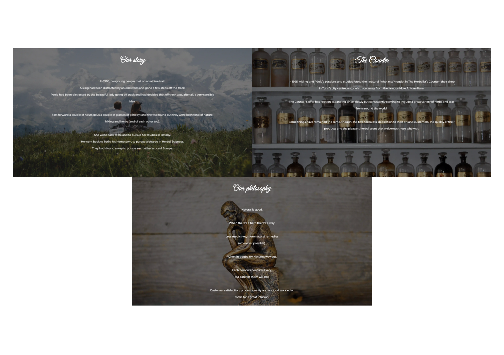

# **The Herbalist's Counter**

The Herbalist's Counter is the website for a herbalist's shop located in Turin, Italy. It is aimed both at first-time customers who are looking for a herbalist in the area and at returning customers who know the shop.

The goal of the Counter and its website is not only to advertise its products for commercial purposes, but also to educate people about the properties of herbs and herbal medicine, thus promoting a healthier lifestyle for all.

## **Site Owners' Goals and User Types**
### Site Owners' Goals
The two herbalists who own the website have two objectives in mind: to make their shop and products known, as well as to educate people about herbs and, more generally, the abundance of natural remedies they have studied and benefited from for years. They have a commercial purpose in mind, in that they make a living out of their herbalist's shop, but they also want to improve their customers' health condition through herbal medicine. Their website is the way to do that: on the one hand, they clearly state what kind of products can be found and purchased in their shop; on the other hand, they tell users a story - their story, how they met, how their passion for and knowledge about herbs have come to be - and they promote two monthly events customers can attend to learn about herbs, try the shop's products and hopefully socialise in the process.
### User Types
* First-time user/visitor:
The first type of website users are the people in search of a herbalist in the city of Turin. They don't know the Counter yet, so they open their browser and search for such a shop in the city. Among the results, they find out about The Herbalist's Counter: who the owners are, what products are on offer, where the shop is located. These users are also intrigued by the fact that the shop organizes two monthly events and therefore decide to go see the place for themselves.
* Returning user/visitor:
The second type of users are already acquainted with the shop, having already been there in the past and enjoyed the experience. They have taken part in the Herbal Friday event once or twice, have had fun there and learnt something new about herbs. They are now in need of another visit to the shop, for instance to purchase a herbal tea for their cold, and they open the website to remind themselves of the opening hours. When they land on the Counter's website, they find out that a Tea Ceremony event will be hosted soon and take note to ask the two owners about it.

## **Features**
### *Existing features*
* Shop logo & Navigation Bar

At the top of each page the user can find the shop logo and the navigation bar. The clickable shop logo represents a shortcut to go back to the homepage, whereas the navigation bar allows for navigation to all the pages in the website: Home, Our shop, Our products, Events, Contact us.

* Homepage

The website's homepage concisely informs users of the shop's location, products and mission.

* Our shop

 Divided in three sections, it provides an opportunity to learn about the story of the two herbalists, their shop and their philosophy/approach to their work.

 * Our products

The products' page allows the site owners to promote their products and the site users to know what they will find in the shop.

* Events

This page serves the shop/website's educational vocation: in it, the two owners promote two events that will attract people to their shop to try their products and learn about herbs. Users come to understand that The Herbalist's Counter is more than just a herbalist's shop: it is a place to meet people, learn something new and find out about ways to improve their health condition.

* Contact us

Here important information about the shop's location and opening hours are shown. The page also provides the users with an opportunity to engage with the two herbalists by filling out a contact form with a personal inquiry.

* Thank-you note

The *Thank you* page, reachable only after filling out the contact form, lets the users know that their message has been successfully sent, that it is appreciated and that a reply will follow soon.

* Copyright & Social media

Placed at the bottom of every page, it allows the users to reach The Herbalist's Counter beyond its website, on Facebook, Instagram, and Twitter. There, new content awaits the user.

### *Features left to implement*
* *YouTube Channel*: The development of a YouTube channel, accessible through its related social media icon, will allow the site owners to share more informative contents about herbs (for instance, by showing how a certain herbal tea is best prepared or by showing short videos of their tea-hunting trips to China and India).
* *Learning page*: An additional page could host separate informative sheets about herbs, each one describing some important qualities of each herb, as well as some interesting anecdote or historical fact. This feature will expand the educational mission of the two herbalists.
* *E-commerce platform*: Not everyone can go to The Herbalist's Counter in person; for this reason, developing an e-commerce platform within the website will allow the shop to extend its commercial reach, shipping its goods to other cities too.
